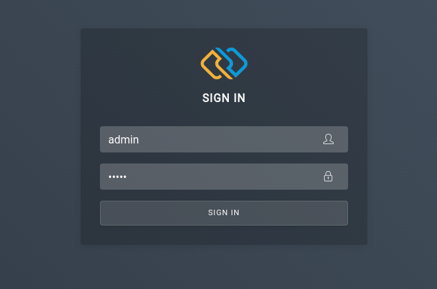
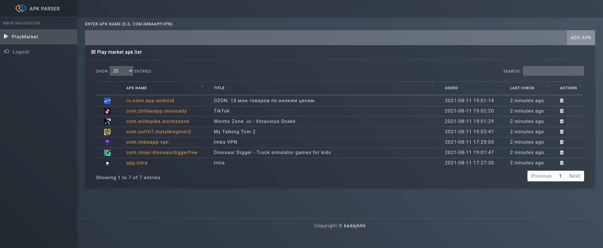

Play market web parser
======
This is a web interface above [Google-Play-Scraper ](https://pypi.org/project/google-play-scraper/ "Google-Play-Scraper ")


Just add apk name (eg. com.imbaapp.vpn) and info will be scrapped and updated from PlayMarket every 5 minutes.

## Installation
1. Clone repository and run with docker-compose
```bash
git clone https://github.com/kadaj666/gps-web
cd gps-web
sudo sudo docker-compose up --build -d
```
2. Wait untill is up

3. Visit http://127.0.0.1:9009 and login with: **admin / admin**


## Web parser screenshots




